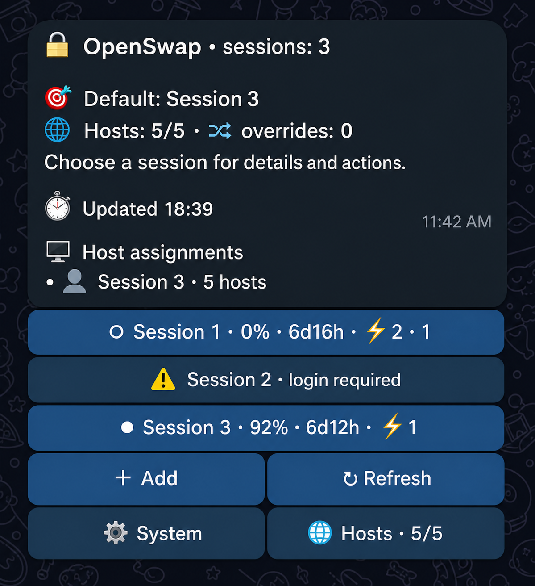

<div align="center">

# OpenSwap

**A small Telegram control plane for ChatGPT Sessions in OpenCode.**

[](https://www.python.org/)
[](#windows-and-linux)
[](https://opencode.ai/)
[](LICENSE)



</div>

OpenCode normally has one active OpenAI login. That becomes awkward when you
have several ChatGPT accounts, work from more than one machine, or want to know
which usage window resets first. Switching credentials by hand is easy to get
wrong, and it gives you no useful view of account health or remaining usage.

OpenSwap turns those credentials into named Sessions and puts the entire
workflow in one compact Telegram message. It shows live usage, reset windows,
login health, earned reset credits, and per-host routing. It changes only the
OpenAI entry in `auth.json`, preserving every unrelated provider.

It is OpenCode-first and also works with
[OpenCodez](https://github.com/Krablante/opencodez), which uses the same
compatible credential store.

## One interface on purpose

OpenSwap has no management CLI, setup wizard, web panel, database, or Docker
stack. There is one manually edited `config.toml`, one process, and one operator
interface: Telegram.

That means every capability lives in one place:

- add a Session with official Codex device-code or browser OAuth;
- import an existing OpenCode or OpenCodez `auth.json`;
- inspect plan, allowance, reset times, and login health;
- refresh or reauthorize a Session;
- select the default Session;
- assign a different Session to one host;
- consume the nearest expiring earned reset after confirmation;
- remove an unassigned Session;
- switch between English and Russian;
- inspect system health and retry synchronization.

The bot edits one message instead of filling the chat. Credential uploads,
OAuth callbacks, and `/language` command messages remove themselves after use.

## Quick start

Install Python 3.11 or newer and the official
[Codex CLI](https://developers.openai.com/codex/cli). The `codex` executable
must be available in `PATH`, or configured with an absolute path.

Clone OpenSwap and create one virtual environment:

```bash
git clone https://github.com/Krablante/openswap.git
cd openswap
python -m venv .venv
```

On Linux:

```bash
.venv/bin/python -m pip install -e .
cp config.example.toml config.toml
```

On Windows PowerShell:

```powershell
.venv\Scripts\python.exe -m pip install -e .
Copy-Item config.example.toml config.toml
```

Edit `config.toml`, then start the bot:

```bash
./start.sh
```

```powershell
.\start.ps1
```

OpenSwap reads the configuration once at startup. Edit the file and restart the
process to apply a change. There is no watcher, hidden generated configuration,
or second source of truth.

## Configuration

The minimal single-host configuration is deliberately small:

```toml
[telegram]
token = "123456:replace-me"
allowed_users = [123456789]

[storage]
directory = "./data"

[opencode]
auth_file = "/home/user/.local/share/opencode/auth.json"

[codex]
binary = "codex"
```

All relative paths are resolved from `config.toml`, never from an unpredictable
shell working directory. On Windows, TOML literal strings avoid escaping
backslashes:

```toml
[opencode]
auth_file = 'C:\path\to\opencode\auth.json'
```

The configuration file contains the Telegram token. OpenSwap automatically
restricts it to the current user on POSIX systems. On Windows, keep it inside a
directory owned by your user account. `config.toml` and `data/` are ignored by
Git.

See [`config.example.toml`](config.example.toml) for scheduler and multihost
settings.

## The Telegram menu

The root screen shows Sessions as compact buttons with remaining allowance,
reset countdown, and earned reset credits. Selecting a Session opens its
details and actions. Host distribution never appears inside a Session button;
with several Sessions and several hosts it is rendered as a separate
`🖥 Host assignments` text block. The block is omitted for one Session or one
host because it would only repeat the active/default state.

`System` is always available without taking over the interface:

- with several hosts, `System` is on the left and `Hosts` is on the right of the
  same bottom row;
- with zero or one configured host, `System` occupies the full bottom row and
  host-management controls disappear.

The System screen reports:

```text
OpenSwap 2.0.0

✓ 🔐 OpenCode · ready
✓ 🤖 Codex · codex-cli 0.x.x
✓ 💾 Storage
! 👤 Sessions · 2/3
✓ 📊 Usage freshness · 2/2
✓ 🌐 Hosts · 5/5

Attention
• One or more Sessions require login
```

It also provides `Retry sync` and `Refresh`. Retrying only wakes the existing
scheduler; Telegram never waits for SSH.

Every scheduler tick refreshes usage and earned reset data for every healthy
Session whose snapshot is due. OAuth refresh no longer suppresses usage refresh,
and a failure in one Session cannot block another Session or the Telegram menu.
Stale data is marked directly in the Session row and in System.

## More than one host

Add a local host and any SSH targets to the same file:

```toml
[sync]
interval_seconds = 120
connect_timeout_seconds = 5
command_timeout_seconds = 15

[[hosts]]
name = "local"
auth_file = "/home/user/.local/share/opencode/auth.json"

[[hosts]]
name = "server"
auth_file = "/home/user/.local/share/opencode/auth.json"
ssh = "user@server.example"
python = "python3"
```

Exactly one local host must point at `[opencode].auth_file`. Remote paths remain
native to the remote operating system, so a Linux coordinator can target a
Windows path and a Windows coordinator can target Linux. Set `python = "python"`
for a Windows SSH target when that is its Python command.

Routing stays intentionally sparse: one Session is the default, and only hosts
that differ are stored as overrides. New hosts inherit the default. Offline
assignments are retained. Successful local changes become `synced` in the same
transaction; remote writes use bounded SSH and compare-and-swap.

## Windows and Linux

The application code is shared. Platform differences are isolated to one small
storage module:

- `portalocker` provides the same process lock on Windows and Linux;
- `os.replace` publishes files atomically;
- Windows sharing violations receive a short bounded retry;
- POSIX permissions are enforced only where they have real meaning;
- no Unix module is imported on Windows;
- SSH is optional and needed only for remote hosts.

The launch scripts differ only in how they locate the virtual-environment
Python. There are no separate Windows and Linux editions.

## Safety

Each Session lives in an isolated credential slot. The registry stores routing,
fingerprints, health, and usage metadata, but never raw access or refresh tokens.
OpenSwap rejects dead imports, blocks deletion of assigned Sessions, preserves
unknown providers, uses atomic writes, and refuses a remote update when the file
changed during publication.

Telegram accepts commands only from configured numeric user IDs in private
chats. Unauthorized updates receive no response. The bot cannot export tokens,
run arbitrary commands, or read arbitrary paths.

Stop the process before backing up or restoring `data/`. The live OpenCode
`auth.json` is a published view; the isolated Session slots are canonical.

See [Architecture](docs/ARCHITECTURE.md),
[Operations](docs/OPERATIONS.md), and [Security](SECURITY.md) for the complete
contracts.

## License

[MIT](LICENSE)
